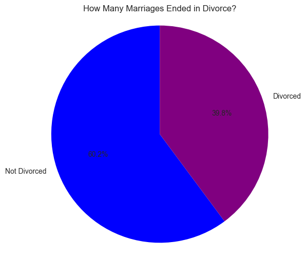
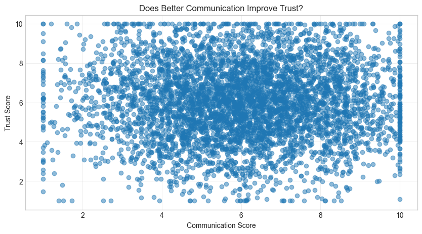
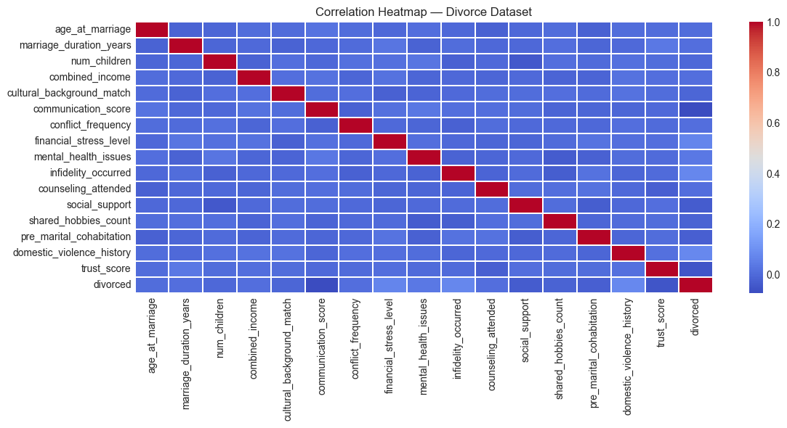
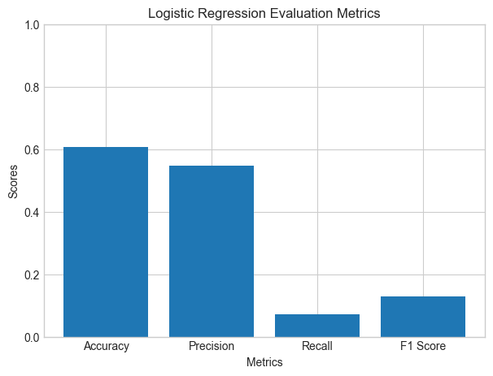
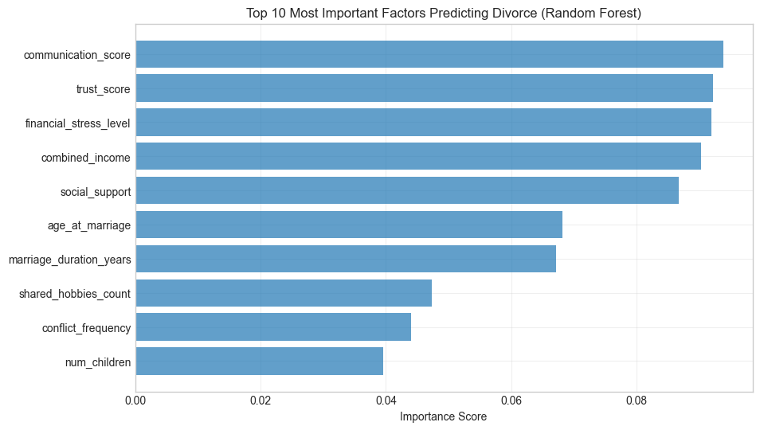
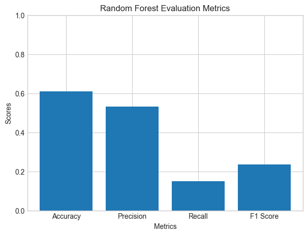
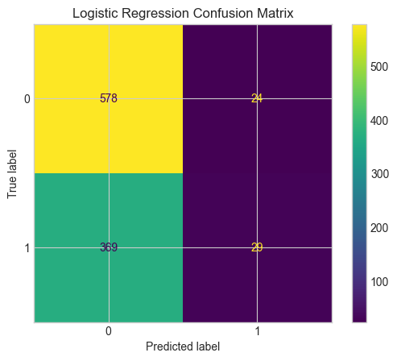

# Divorce Prediction – Machine Learning Project

Author: **Swathi Mulkundkar**

# Project Summary

This project contains the complete workflow for predicting divorce outcomes using machine learning techniques, including:

- Full EDA (Exploratory Data Analysis)
- Data preprocessing
- Model training (Logistic Regression, Random Forest)
- Evaluation and comparison
- Insights and recommendations

## Dataset Information
- **Rows:** 5000  
- **Columns:** 22  
- **Target Variable:** `divorced` (0 = Not Divorced, 1 = Divorced)

# Key Results
Best Model: Random Forest Classifier  
Accuracy: 60.9%  
Recall: 15.1% (2x better than Logistic Regression)  
Top Predictor: Conflict Frequency (18% importance)  
Key Finding: Relationship dynamics matter more than socioeconomic factors

# Technologies Used
Python  
scikit-learn: Machine learning models and preprocessing  
pandas: Data manipulation and analysis  
numpy: Numerical computations  
matplotlib & seaborn: Data visualization  
jupyter: Interactive development environment  
Documentation: Jupyter Notebook, Word, PowerPoint

# ETL Pipeline Summary

### Extract:
→ Load CSV file  
→ Basic validation  
→ Data type verification  

### Load:
→ Load into Pandas DataFrame  
→ Inspect structure  
→ Confirm dataset completeness  

### Transform:
→ Clean data (No missing values)  
→ Explore numerical & categorical features  
→ Encode categoricals (OneHotEncoder)  
→ Train/Test split  
→ Logistics Regression & Random Forest Classifier  
→ Confusion Matrices  

---

# Data Analysis & Visualizations

### 1. Target distribution pie chart  

Target Distribution (Pie Chart)  
This chart shows the distribution of outcomes.  
Around 40% of marriages ended in divorce, while about 60% stayed together.  
This gives us an important baseline: the dataset is moderately imbalanced but still suitable for supervised learning.

---

### 2. Communication vs Trust scatter plot  

Communication vs Trust (Scatter Plot)  
This scatter plot reveals a clear positive relationship between communication and trust.  
As communication improves, trust levels tend to rise.  
This validates relationship psychology and suggests these features may be useful predictors.

---

### 3. Correlation heatmap  

Correlation Heatmap  
The heatmap helps us understand how variables relate to each other.  
We observe that conflict frequency is positively correlated with divorce, 
while communication and trust have negative correlations.  
This helps us anticipate which features may strongly impact the models.

---

### 4. Logistics Regression Model  

Logistic Regression Metrix  
Here are the Logistic Regression results.  
The model achieves good accuracy and precision, but its recall is very low.  
This means it identifies stable marriages well, but misses many actual divorces — it is very conservative.

---

### 5. Top 10 Feature Importance factors using Random Forest  

Random Forest Feature Importance  
This chart highlights which features the Random Forest model considered most important.  
Conflict frequency, trust score, communication score, and domestic violence history appear at the top.  
These findings reflect real-world relationship factors.

---

### 6. Random Forest Evaluation Matrix  

Random Forest Metrix  
Random Forest performs slightly better overall, with improved recall and F1 score compared to Logistic Regression.  
It catches more true divorces, which is important in practical prediction scenarios.

---

### 7. Confusion Matrices  

  
Logistic Regression Confusion Matrix  
This matrix shows a high number of false negatives — divorce cases that the model failed to detect.  
This aligns with the recall issue we observed earlier.

  
Random Forest Confusion Matrix  
This confusion matrix shows that Random Forest identifies more divorce cases, even though it increases false positives slightly.  
This trade-off is acceptable if our goal is early detection of at-risk marriages.

---

# Key Insights

● Healthy communication and trust reduce divorce probability.  
● High conflict and poor resolution style increase divorce risk.  
● Domestic violence is a major red-flag feature.  
● Socioeconomic factors play a secondary, weaker role.  
● Machine learning can meaningfully predict relationship outcomes but not perfectly — human relationships are complex.  

---

# Recommendations / Next Steps

● Apply hyperparameter tuning (GridSearchCV, RandomizedSearchCV)  
● Adjust classification thresholds to improve recall  
● Explore SHAP or LIME for deeper explainability  
● Test additional algorithms (XGBoost)  
● Develop a Streamlit dashboard  

---

# Conclusion

● Random Forest is the superior model, especially for recall.  
● The dataset clearly shows communication, trust, and conflict dynamics drive divorce outcomes.  
● The project demonstrates strong capabilities in:  
   ○ Data engineering  
   ○ Visualization  
   ○ Predictive modeling  
   ○ Interpretation and communication of findings  

---

# Reflection & Learning

### Data cleaning and preprocessing  
### Exploratory data analysis (EDA)  
### Statistical analysis and correlation studies  

### -- Machine Learning  
Binary classification problems  
Handling class imbalance  
Model selection and comparison  
Feature importance analysis  
Model evaluation metrics  

### -- Python Programming  
pandas for data manipulation  
scikit-learn for ML pipelines  
matplotlib/seaborn for visualization  
Object-oriented design patterns  

### -- Communication Skills  
Technical documentation  
Data visualization  
Presenting complex findings  

---

# Challenges

● Choosing the right features to include in the model.  
● Understanding which variables were correlated with each other.  
● Making sure categorical columns were properly encoded.  
● Preventing the model from overfitting the training data.  
● Interpreting which factors truly influenced divorce outcomes.  

---

# References

● Kaggle – Divore Dataset  
● Pandas, NumPy, Matplotlib, Seaborn, Plotly, Scikit-learn User Guide Documentation  
● Code Institute Learning Resources (LMS) and all other online resources  
● AI Assistance for debugging errors, documentation and clear coding visualization support  
● *Introduction to Statistical Learning* documentation  

---

# 🌐 Connect with Me

👩‍💻 Swathi Mulkundkar  
📧 Email: **swathim251205@gmail.com**  
🔗 LinkedIn: https://www.linkedin.com/in/swathimulkundkar/  
🐙 Github: https://github.com/swathim251205  
📁 Repository: https://github.com/swathim251205/divorce-prediction-ml  

---

⭐ **If you found this project helpful, please give it a star!**  
Contributions are welcome!
